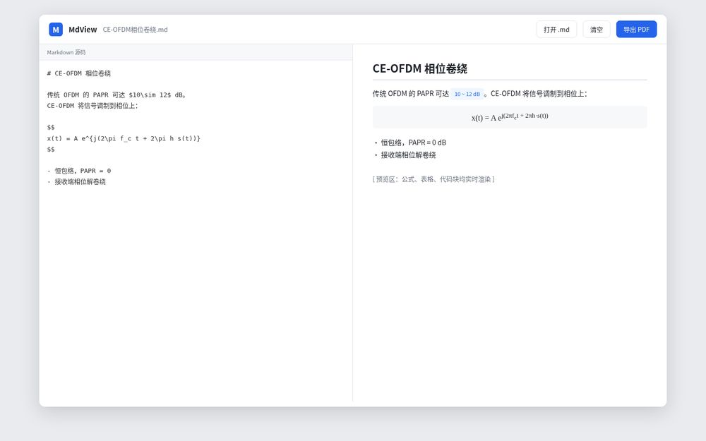
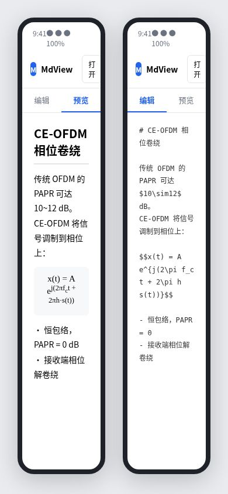

# MdView 设计文档

> **维护约定**：本文档是 MdView 的唯一权威设计依据。每次功能新增、技术方案变更、版本发布前，必须同步更新本文档并在文末「变更记录」追加一条。代码与文档不一致时，以最新版本为准并尽快对齐。

| 项 | 值 |
| --- | --- |
| 文档版本 | v0.2（初稿） |
| 最近更新 | 2026-09-21 |
| 状态 | 方案设计中，待评审 |
| 仓库 | github.com/`<owner>`/MdView（待建） |

---

## 1. 项目目标

做一个**纯前端、零后端、免费托管**的 Markdown 查看与 PDF 导出工具，核心解决「AI 输出的带数学公式的 Markdown 文件，手机上打开难看、转 PDF 麻烦」的问题。交付两个形态：

1. **网页版**：手机/电脑浏览器打开网址，选 md 文件即用；
2. **安卓版**：GitHub Releases 下载 APK，安装后离线使用。

明确不做：用户账号、云同步、多人协作、付费功能。

## 2. 用户场景与需求

### 2.1 核心场景

- 学生/研究者在手机上打开带 LaTeX 公式的 md 笔记，导出可打印的 PDF；
- 手机浏览器里粘贴一段 AI 输出的 md，即时看效果并存为 PDF；
- 无网络环境下也能用（安卓离线包、网页版 PWA）。

### 2.2 功能需求（MVP → 后续）

| 编号 | 需求 | 优先级 |
| --- | --- | --- |
| F1 | 打开本地 .md 文件（FileReader） | P0 |
| F2 | 粘贴文本渲染 | P0 |
| F3 | 实时预览，支持 GFM（表格、列表、代码块） | P0 |
| F4 | LaTeX 数学公式渲染（`$...$`、`$$...$$`） | P0 |
| F5 | 导出 PDF（浏览器打印） | P0 |
| F6 | 移动端适配（编辑/预览切换） | P0 |
| F7 | 代码语法高亮 | P1 |
| F8 | Mermaid 流程图渲染 | P1 |
| F9 | PWA 离线安装（service worker 缓存） | P1 |
| F10 | PDF 页眉页脚/页码/封面 | P2 |
| F11 | 暗色模式 | P2 |
| F12 | 拖拽打开文件 | P2 |
| F13 | 最近文档列表（下拉，最多 10 个，本地记忆，点击快速切换） | P1 |

### 2.3 非功能需求

- **隐私**：文件不离开设备，纯浏览器本地处理；
- **性能**：首屏可用 < 3s（4G）；
- **兼容**：Android 8.0+（minSdk 24）、iOS Safari、Chrome/Edge 最新版；
- **成本**：网页版托管在 GitHub Pages（免费），APK 由 GitHub Actions 自动构建（免费额度内）。

## 3. 可借鉴的开源项目调研

> 原则：优先站在成熟开源项目肩膀上，不重复造编辑器内核。

### 3.1 编辑器内核（直接引入）

| 项目 | License | 可借鉴点 | 结论 |
| --- | --- | --- | --- |
| **Vditor** (Vanessa219/vditor) | MIT | 浏览器端 Markdown 编辑器，原生支持 KaTeX 公式、代码高亮、Mermaid、所见即所得/分屏/即时渲染三模式，TS 编写，可纯 CDN 引入 | **首选内核**，替代手写 textarea |
| **Cherry Markdown** (Tencent/cherry-markdown) | Apache-2.0 | 腾讯出品，开箱即用，内置导出 PDF/图片，偏文档场景 | 备选内核 |
| editor.md (pandao/editor.md) | MIT | 老牌嵌入式编辑器 | 偏老，暂不考虑 |

### 3.2 同类完整应用（参考交互与 PWA 方案）

| 项目 | 可借鉴点 |
| --- | --- |
| **MD View**（Product Hunt 收录的同名 PWA） | 轻量、移动端优先、本地文件 + 导出 PDF 的完整交互 |
| readlocal.app | FileReader 隐私设计、Workbox service worker 离线缓存方案 |
| marcdown (liyasthomas/marcdown, MIT) | PWA 结构、拖拽打开、滚动同步、暗色模式 |
| hattray/markdown-editor (MIT) | KaTeX + Mermaid + 导出 html/pdf 的单文件实现 |

### 3.3 调研结论

1. **编辑器内核改用 Vditor**：当前手写的 textarea + marked 版本仅作 MVP 占位；正式版引入 Vditor，公式/高亮/Mermaid 一次到位，省掉自研维护。
2. **PWA 离线是标配**：v1 必须加 service worker，否则网页版每次都要联网拉 CDN。
3. **PDF 导出走浏览器 print**：同类产品均如此；页眉页脚等增强后续再做。

## 4. 技术选型

| 层 | 选型 | 说明 |
| --- | --- | --- |
| Markdown 渲染 | Vditor（CDN 引入） | 内置 KaTeX，公式质量已验证 |
| 数学公式 | KaTeX（Vditor 内置） | 浏览器端渲染，无需 LaTeX 环境 |
| PDF 导出 | 浏览器 `window.print()` | 打印样式 CSS 控制排版 |
| 离线 | Service Worker（Workbox 手写或极简版） | 缓存 CDN 资源 |
| 安卓壳 | Android WebView + assets 离线包 | 加载本地 index.html |
| 安卓构建 | GitHub Actions（setup-java + setup-android + gradle） | 自动出 APK |
| 托管 | GitHub Pages（网页版）+ Releases（APK） | 零成本 |

## 5. 系统架构

### 5.1 网页版

```
index.html（单页应用）
  ├─ Vditor（CDN）：编辑 + 预览 + 公式渲染
  ├─ 文件读取：FileReader API（本地，不上传）
  ├─ 导出 PDF：window.print() + @media print 样式
  └─ service worker：离线缓存
```

### 5.2 安卓版

```
MainActivity（WebView）
  ├─ 加载 file:///android_asset/index.html（离线包）
  ├─ onShowFileChooser：调用系统文件选择器
  └─ 打印/分享：复用网页版 print 流程
```

### 5.3 数据流

```
用户选 .md → FileReader 读文本 → Vditor 渲染 → 用户点导出 → 浏览器打印为 PDF
```

全程无网络请求（首次加载 CDN 资源除外），无后端。

## 6. 仓库结构（目标）

```
MdView/
├── index.html              # 网页版单页应用
├── sw.js                   # service worker（v1）
├── docs/design.md          # 本文档
├── README.md
├── android/                # 安卓 WebView 工程
│   └── app/src/main/
│       ├── assets/index.html   # 网页版离线副本
│       ├── java/com/mdview/app/MainActivity.java
│       └── res/...
└── .github/workflows/android.yml   # 自动构建 APK
```

## 7. CI/CD 与发布

| 触发 | 动作 | 产物 |
| --- | --- | --- |
| push 到 main | GitHub Actions 构建 debug APK | Actions 页可下载 |
| 打 tag v*.* | 构建 release APK 并创建 Release | Releases 页下载 |
| push 到 main | GitHub Pages 自动部署 | 网页版线上地址 |

> 待办：release 工作流、签名配置（上架前需要）。

## 8. 版本路线图

| 版本 | 内容 | 状态 |
| --- | --- | --- |
| v0.1（MVP） | 手写 textarea + marked + KaTeX，基础打开/渲染/打印 | 已完成初稿，待评审后决定是否保留 |
| v1.0 | 引入 Vditor 内核；PWA 离线；安卓 APK 可装；GitHub Pages 上线 | 待开发 |
| v1.1 | 代码高亮、Mermaid、暗色模式、拖拽 | 待排期 |
| v2.0 | PDF 页眉页脚/封面/目录；release 签名版 APK | 远期 |

## 9. 界面设计

> 以下为界面示意稿（非最终视觉，开发时以 Vditor 实际组件为准）。

### 9.1 网页版 · 桌面端

顶栏：Logo + 文件名 + 打开文件 / 清空 / 导出 PDF；主区左右分栏，左编辑右预览。



### 9.2 网页版 · 手机端 / 安卓 App

顶栏收窄，下方「编辑 / 预览」Tab 切换；安卓 App 为同一界面的 WebView 全屏容器。左为预览页，右为编辑页。



### 9.3 交互说明

- **打开文件**：点「打开 .md」调系统文件选择器，FileReader 本地读取；
- **导出 PDF**：点「导出 PDF」调浏览器打印，打印样式自动隐藏工具栏；
- **安卓版**：无额外界面，启动即加载预览，文件选择走系统 Intent。
- **最近文档**：顶栏「最近文档 ▾」下拉列出最近打开的文件（localStorage 存内容快照，最多 10 个），显示文件名 + 相对时间 + 大小，可单条移除或一键清除；安卓版后续可扩展为记住真实文件 URI。

## 10. 待决策事项

1. ~~编辑器内核~~：**已确认采用 Vditor**（2026-09-21）。
2. **APK 分发**：先出 debug 版直接分发（零配置），release 签名版待正式上架时再配。
3. **仓库名/owner**：确认 GitHub 用户名与仓库名 `MdView`，并提供 Personal Access Token。

---

## 变更记录

| 日期 | 版本 | 变更 |
| --- | --- | --- |
| 2026-09-21 | v0.1 | 初稿：纯前端方案、手写 MVP、安卓 WebView + CI |
| 2026-09-21 | v0.2 | 补充开源项目调研，提出改用 Vditor 内核、增加 PWA 离线需求 |
| 2026-09-21 | v0.3 | 确认采用 Vditor；新增界面设计稿（桌面端 + 手机端/安卓）；明确 debug APK 先行 |
| 2026-09-22 | v0.4 | 新增 F13：最近文档下拉列表（localStorage 存内容快照，最多 10 个，LRU，单删/全清） |
